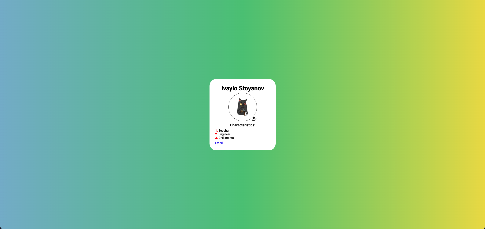
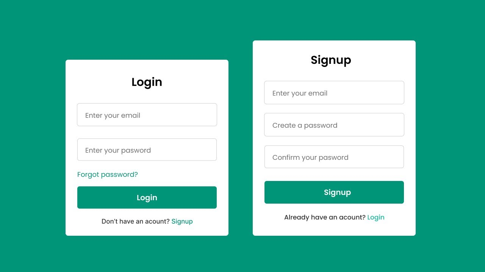
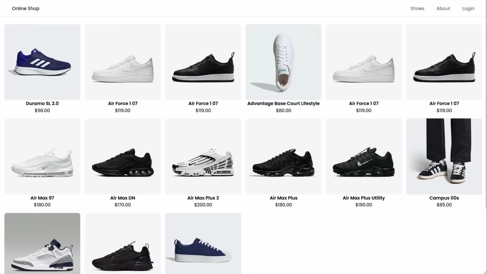

# TASK 1

Създайте картичка с информация за вас центрирана в средата на сайта.

### Пример:

# Task 2

Създайте 2 форми

- логин състояща се от полетата: username и password
- регистрация състояща се от полетата: username, password, first name, last name, email, checkbox for receiving promotional emails, radio button for gender, date of birth.

Нека от едната формата да може да се навигира до другата и обратното.

### Пример:

# Task 3

Създайте website за покупка на обувки с:

- Navigation bar
- Section for shoes split into cards
- Footer

Направете 2 решения на задачата, 1 използвайки flex box, и друго използвайки grid

### Пример:

